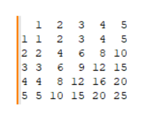

### Задача 

Написать метод, который в консоль выводит таблицу умножения. На вход метод получает число, до которого выводит таблицу умножения. В консоли должна появиться таблица. Например, если на вход пришло число 5, то получим:

